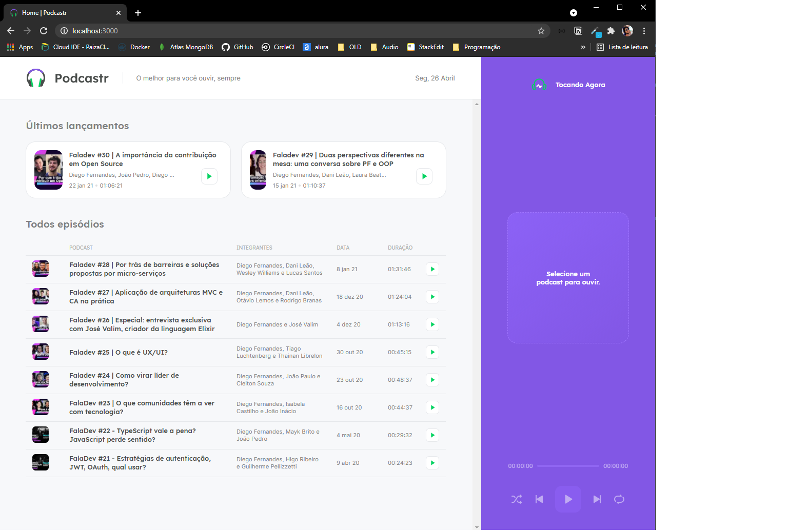
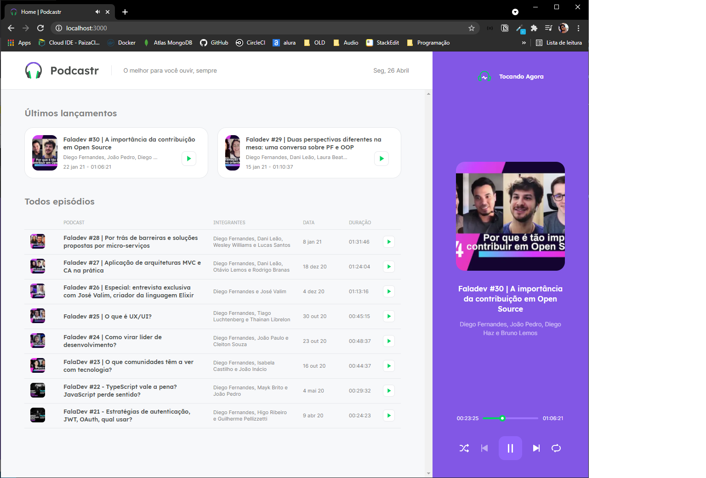
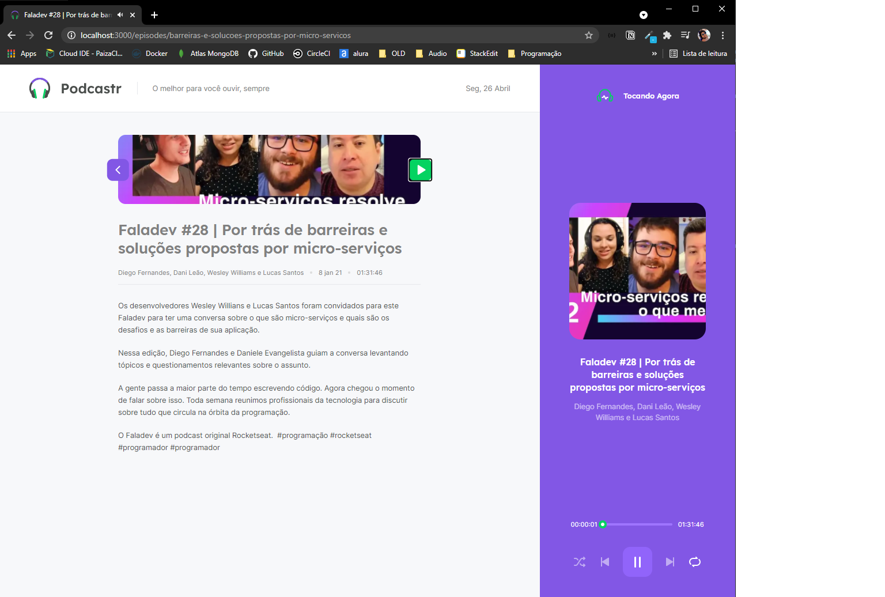

# Podcastr

Projeto criado pela Rocketseat para o NLW5

Podcastr uma plataforma para execução de Podcasts.

feito em React com Next.JS

## Dependências
- axios
- date-fns
- next
- rc-slider
- react
- react-dom 
- sass

## Executar
Execute os comando abaixo na pasta podcastrnext

em um terminal execute o comando
```
yarn server
```
e em outro terminal execute
```
yarn dev
```

## Para simular produção execute os comandos na ordem
- yarn builder
- yarn start

## Imagem da aplicação




# React Helpers

## Create React Project

### React-App
- npx create-react-app PROJECT_NAME

### React with Next
- npx create-next-app PROJECT_NAME


## React
- https://date-fns.org/
- https://react-icons.github.io/react-icons

## Next.JS
```

export async function getStaticProps(){
  const response = await fetch('http://localhost:3333/episodes')
  const data = await response.json()
  
  return {
    props: {
      episodes: data
    },
    revalidate: 60 * 60 * 8
  }
 //revalidate é o tempo em MS para a cada quanto tempo a tela será atualizada
  }
 
}

export async function getServerSideProps(){
  const response = await fetch('http://localhost:3333/episodes')
  const data = await response.json()
  
  return {
    props: {
      episodes: data
    }
  }
 
}
```


Carregar a tela antes de clicar (tag onMauseEnter do READ)
````
import { useRouter } from 'next/router'
const router = useRouter()
router.prefetch(`/episodes/${episode.id}`)
```

### Pagina dinâmica Estática

```
export const getStaticPaths: GetStaticPaths = async () => {
  return {
    paths: [],
    fallback: 'blocking'
  }
}
```

Se o fallback estiver como:
- blocking : Caso ele tente acessar uma pagina que não esteja nos paths ele vai fazer o carregamento da pagina via serverSide e vai criar o Static (melhor para SEO)

- False: Caso ele tente acessar uma pagina que não esteja nos paths ele vai retornar 404

- true: Caso ele tente acessar uma pagina que não esteja nos paths ele vai fazer o carregamento da pagina via Client e vai criar o Static


### Exemplo de loading


```
import { useRouter } from 'next/router'


  const router = useRouter();

  // Antes do Return do componente
  if(router.isFallback){
    return <p>Loading</p>
  }
```